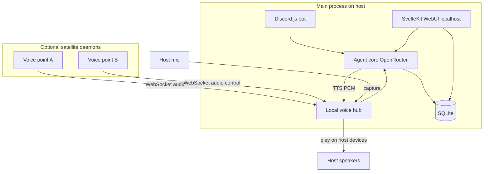
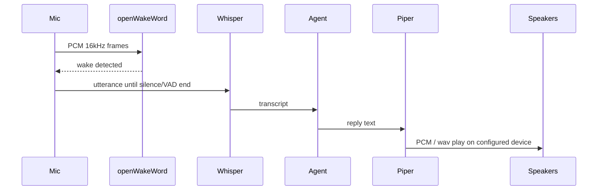

# CottAssistant — Local Full-Agent Assistant

## Locked decisions


| Area     | Choice                                                                                        |
| -------- | --------------------------------------------------------------------------------------------- |
| Runtime  | Bun + end-to-end TypeScript                                                                   |
| Topology | Everything on one local machine; optional satellite **voice daemons** for extra rooms/devices |
| LLM      | OpenRouter                                                                                    |
| Agent    | Full: tools, shell, memory/files, skills; Discord-gated for sensitive actions                 |
| Voice    | openWakeWord → Whisper STT → Piper TTS                                                        |
| WebUI    | SvelteKit, **bind `127.0.0.1` only**; first registered account = administrator                |
| Discord  | DMs, `@` mentions in guilds, slash commands                                                   |


## Architecture




**Main process** owns Discord, WebUI, agent loop, SQLite, and the local voice hub (mic/speaker selected in WebUI for **this** host).

**Satellite daemon** (`cottassistant-voice`): runs on another machine/room, captures wake+utterance, streams audio or transcripts to main, plays TTS. WebUI on main lists connected points and configures **each point’s** input/output devices (daemon reports device lists; settings are applied on the daemon host, not in the browser).

## Monorepo layout

```
CottAssistant/
  apps/
    server/          # Bun main: Discord + agent + voice hub + API
    web/             # SvelteKit UI (adapter-node, host 127.0.0.1)
    voice-daemon/    # Optional satellite voice client
  packages/
    core/            # Agent loop, tools, memory, skills, policy
    shared/          # Zod schemas, types, WS protocol
  data/              # SQLite, memory markdown, models (gitignored)
```

Workspace: Bun workspaces. Single `bun run dev` starts server + web; `bun run voice-daemon` for satellites.

## Core packages

### Agent (`packages/core`)

- **OpenRouter client** — chat completions; model configurable in WebUI (default e.g. `openai/gpt-4.1-mini` or whatever you set).
- **Session router** — one conversation context per channel: `discord:dm:{userId}`, `discord:guild:{channelId}`, `web:{userId}`, `voice:{pointId}`.
- **Tools** — typed tool registry: shell, filesystem (scoped roots), web fetch/search, memory read/write, skills loader.
- **Policy** — every tool has a sensitivity: `public` | `sensitive`.  
  - WebUI (authenticated admin/session): sensitive allowed.  
  - Discord: sensitive only if message author’s Discord snowflake is in `authorized_discord_users`. Unauthorized users get chat-only / public tools + a clear refusal for sensitive asks.  
  - Voice points: treat as **owner-trusted** (local physical access); sensitive allowed unless you later add voice PIN.
- **Memory** — SQLite metadata + markdown files under `data/memory/` (heartbeat / append notes pattern).
- **Skills** — folder skills (`SKILL.md` + scripts), discovered at startup; same idea as agent skill packs.

### Persistence (`bun:sqlite`)

Tables (sketch): `users` (web accounts; first insert → `role: admin`), `sessions`, `authorized_discord_users`, `settings` (OpenRouter key, model, Discord token), `voice_points` (id, name, last_seen, device prefs), `conversations` / `messages` optional for history.

Secrets in SQLite or `.env` for bootstrap (`DISCORD_TOKEN`, `OPENROUTER_API_KEY`); WebUI can store/update after admin login.

## Discord (`apps/server` + discord.js)

- Intents: Guilds, GuildMessages, MessageContent, DirectMessages.
- Handlers: DM text, guild message when bot is `@mentioned`, slash commands (`/ask`, `/status`, `/approve` if needed).
- Before any sensitive tool: resolve `interaction.user.id` / `message.author.id` against `authorized_discord_users`.
- Replies: streaming or chunked messages; ephemeral for slash where useful.
- Config: bot token + authorized IDs managed in WebUI (admin).

## WebUI (`apps/web` SvelteKit)

- **Bind**: `127.0.0.1` only (document that remote access needs SSH tunnel).
- **Bootstrap**: if no users → setup page creates first admin (username + password, hashed with Bun password APIs).
- **Auth**: session cookie (HTTP-only, SameSite=strict, secure only if HTTPS later).
- Pages (v1):
  - Chat with the agent
  - Settings: OpenRouter key/model, Discord token
  - **Authorized Discord users** (add/remove snowflake IDs + optional label)
  - **Audio devices**: list/select input + output for **local hub** and for each connected **voice point** (devices come from host/daemon APIs, not `navigator.mediaDevices`)
  - Voice points status (connected satellites)
  - Basic memory / skills overview

Server API routes live in SvelteKit or proxied to `apps/server` — prefer **one Bun HTTP server** that mounts SvelteKit handler + JSON/WebSocket APIs to avoid two ports fighting auth.

## Voice pipeline




- **Capture/play on host**: Linux-first (your Arch box) via PipeWire/ALSA helpers (`pw-record` / `pw-play` or a small native binding). Enumerate devices with `pw-cli` / `pactl` and expose JSON to WebUI. Store selected sink/source IDs in `voice_points` / settings.
- **OWW**: `openwakeword-js` + ONNX models under `data/models/`; default pretrained phrase (e.g. “hey jarvis” / configurable model path). Silero VAD optional to cut false triggers.
- **Whisper**: local `whisper.cpp` binary (or `whisper-cli`) invoked with wav; model size configurable (`base`/`small`). Keeps STT offline.
- **Piper**: local Piper binary + voice model; play to configured output device.
- **Satellite protocol** (`packages/shared`): WebSocket with messages `hello`, `device_list`, `set_devices`, `wake`, `audio_chunk` / `transcript`, `tts_audio`, `ping`. Auth: shared daemon token from WebUI.

Browser is **never** the mic/speaker for the assistant — only the WebUI for config/chat.

## Auth & sensitivity matrix


| Surface                      | Who                          | Sensitive tools                    |
| ---------------------------- | ---------------------------- | ---------------------------------- |
| WebUI chat                   | Logged-in web user           | Yes (admin; later roles if needed) |
| Discord DM / mention / slash | Discord user ID in allowlist | Yes                                |
| Discord other users          | Anyone else                  | Public tools / chat only           |
| Local / satellite voice      | Physical point               | Yes (owner-trusted)                |


Admin WebUI is the only place to manage Discord allowlist and API tokens.

## Config & env

```bash
# .env (bootstrap)
DISCORD_TOKEN=
OPENROUTER_API_KEY=
HOST=127.0.0.1
PORT=8787
VOICE_DAEMON_TOKEN=   # for satellites
DATA_DIR=./data
```

## Implementation phases

### Phase 1 — Skeleton

Bun workspaces, `packages/shared` types, SQLite schema, SvelteKit localhost app with first-admin bootstrap + login, health check.

### Phase 2 — Agent + Web chat

OpenRouter provider, tool loop, shell/fs/memory/skills with policy hooks, WebUI chat wired to agent.

### Phase 3 — Discord

discord.js client, DM + mention + slash, Discord ID allowlist UI, enforce policy on sensitive tools.

### Phase 4 — Local voice

Device enumeration API for host, WebUI device picker (host devices), OWW → Whisper → agent → Piper loop on main process.

### Phase 5 — Satellite daemons

`apps/voice-daemon`, WS protocol, multi-point device config in WebUI, play/capture on remote hosts.

## Out of scope for v1

- Cloud hosting / non-localhost WebUI without tunnel
- Mobile apps
- Training custom wake words in-app (use pretrained / external train → drop ONNX)
- Multi-admin RBAC beyond first-admin + Discord allowlist

## Sensible defaults to ship

- Wake model: bundled OWW pretrained ONNX (configurable path)
- Whisper: `ggml-base.en` via whisper.cpp
- Piper: `en_US-lessac-medium`
- LLM: user-picked on OpenRouter; document a cheap default in README

