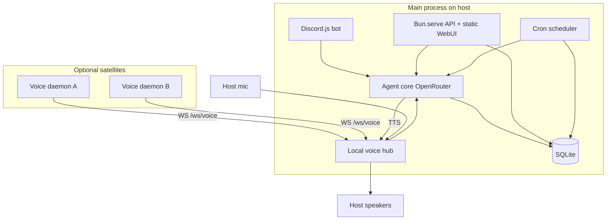

# Architecture

CottAssistant is a Bun monorepo. One **main process** owns Discord, the HTTP/WebSocket API, the agent loop, SQLite, the local voice hub, and the cron scheduler. Optional **satellite voice daemons** connect over WebSocket for extra rooms/devices.

## Packages

| Package | Role |
|---------|------|
| `apps/server` | Entry: `Bun.serve`, Discord, local voice, cron, static SPA |
| `apps/web` | SvelteKit SPA (`adapter-static`), Vite dev proxy to `:8787` |
| `apps/voice-daemon` | Satellite client: devices, wake/capture, STT, play TTS |
| `packages/core` | Agent, tools, DB, auth, memory, skills, audio, models, crons |
| `packages/shared` | Zod types, actor policy, daemon WS protocol |

## Sessions

Conversation history is keyed by channel:

| Channel | Format |
|---------|--------|
| WebUI | `web:{userId}` |
| Discord DM | `discord:dm:{userId}` |
| Discord guild | `discord:guild:{channelId}` |
| Voice | `voice:{pointId}` |
| Cron run | `cron:{jobId}` |

Messages are stored in SQLite (`messages` table).

## Actors & policy

Every agent turn has an **actor**:

- `web` — logged-in WebUI user (`allowSensitive: true`)
- `discord` — Discord snowflake; sensitive only if ID is in `authorized_discord_users`
- `voice` — voice point id; treated as owner-trusted (`allowSensitive: true`)

See [tools.md](tools.md).

## Persistence

SQLite at `$DATA_DIR/cottassistant.sqlite` (default `./data/cottassistant.sqlite`):

- `users` / `sessions` — WebUI accounts (first user is `admin`)
- `authorized_discord_users` — Discord allowlist
- `settings` — OpenRouter, Discord token, voice model prefs, etc.
- `voice_points` — local + satellite points and device prefs
- `messages` — chat history per channel
- `cron_jobs` — scheduled reminders / recurring jobs

Filesystem under `$DATA_DIR`:

- `memory/` — markdown notes
- `skills/` — skill folders (`SKILL.md`)
- `models/` — wake word / Whisper / Piper downloads

## System prompt assembly

1. Load base text from `SYSTEM.md` (or `SYSTEM_PROMPT_PATH`).
2. Append runtime actor + sensitive-tools flag.
3. If voice: append VOICE MODE rules (plain speech, `request_voice_followup`).
4. Append installed skills summary + full tool list.

## WebUI serving

- **Dev:** Vite on `127.0.0.1:5173`, proxies `/api` (and WS) to the server.
- **Prod-ish:** `bun run build` writes `apps/web/build`; the main server serves those static files on the same port as the API.

Remote access is intentionally local-only; use an SSH tunnel if needed.
